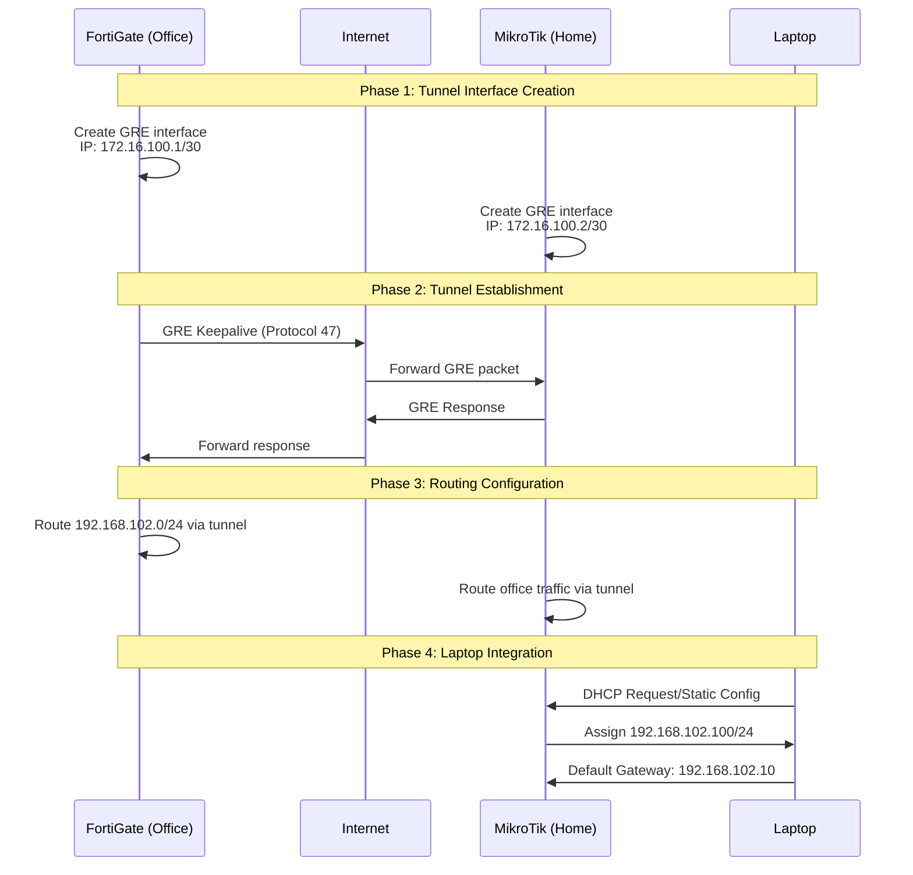

# GRE Tunnel Technical Architecture & Implementation
## Layer 2/3 Network Extension via Generic Routing Encapsulation

---

## System Architecture Overview

```
┌─────────────────────────────────────────────────────────────────────────────────┐
│                              INTERNET BACKBONE                                   │
│                                                                                 │
│    ┌─── ISP A ────┐                                           ┌─── ISP B ────┐  │
│    │              │◄─────── GRE Protocol 47 ────────────────►│              │  │
│    │              │        Encapsulated Traffic              │              │  │
│    └──────────────┘                                          └──────────────┘  │
└─────────────────────────────────────────────────────────────────────────────────┘
           │                                                            │
           │                                                            │
    ┌──────▼──────┐                                            ┌──────▼──────┐
    │ FortiGate   │                                            │  MikroTik   │
    │ 100 Series  │◄──────── GRE Tunnel ─────────────────────►│   Router    │
    │             │          172.16.100.0/30                  │             │
    │ WAN: x.x.x.x│                                            │ WAN: y.y.y.y│
    └──────┬──────┘                                            └──────┬──────┘
           │                                                          │
           │ 192.168.102.1/24                              ┌─────────┼─────────┐
           │                                               │         │         │
    ┌──────▼─────────────────────┐                        │         │         │
    │     OFFICE LAN             │                        │         │         │
    │   192.168.102.0/24         │                192.168.101.1/24  │  192.168.102.10/24
    │                            │                        │         │         │
    │ ┌─────┐ ┌─────┐ ┌─────┐   │               ┌────────▼───┐  ┌──▼──────┐  │
    │ │ PC1 │ │ PC2 │ │SrvR │   │               │ Home Bridge│  │ Office  │  │
    │ │.102.│ │.103 │ │.104 │   │               │192.168.101.│  │ Bridge  │  │
    │ │  11 │ │     │ │     │   │               │    0/24    │  │         │  │
    │ └─────┘ └─────┘ └─────┘   │               └────────────┘  └─────────┘  │
    └────────────────────────────┘                      │            │       │
                                                         │            │       │
                                                 ┌───────▼──┐    ┌────▼────┐  │
                                                 │Home Dev1 │    │ Laptop  │  │
                                                 │.101.100  │    │.102.100 │  │
                                                 └──────────┘    └─────────┘  │
                                                                              │
                                                 HOME NETWORK                 │
                                                ──────────────────────────────┘
```

---

## Protocol Stack Analysis

### GRE Encapsulation Structure

```
┌─────────────────────────────────────────────────────────────────────────┐
│                        PHYSICAL LAYER                                   │
├─────────────────────────────────────────────────────────────────────────┤
│                     DATA LINK LAYER (Ethernet)                         │
├─────────────────────────────────────────────────────────────────────────┤
│                  OUTER IP HEADER (Internet Routing)                    │
│  ┌─────────────────────────────────────────────────────────────────┐   │
│  │ Src IP: Office Public IP    Dst IP: Home Public IP          │   │
│  │ Protocol: 47 (GRE)                                         │   │
│  └─────────────────────────────────────────────────────────────────┘   │
├─────────────────────────────────────────────────────────────────────────┤
│                         GRE HEADER                                     │
│  ┌─────────────────────────────────────────────────────────────────┐   │
│  │ C|R|K|S|s|Recur|  Flags  | Ver |    Protocol Type: 0x0800    │   │
│  │ ──────────────────────────────────────────────────────────── │   │
│  │                    Checksum (optional)                      │   │
│  │                       Key (optional)                        │   │
│  │                   Sequence Number (optional)                │   │
│  └─────────────────────────────────────────────────────────────────┘   │
├─────────────────────────────────────────────────────────────────────────┤
│                    INNER IP HEADER (Payload)                           │
│  ┌─────────────────────────────────────────────────────────────────┐   │
│  │ Src IP: 192.168.102.100   Dst IP: 192.168.102.11           │   │
│  │ Protocol: TCP/UDP/ICMP                                      │   │
│  └─────────────────────────────────────────────────────────────────┘   │
├─────────────────────────────────────────────────────────────────────────┤
│                      APPLICATION DATA                                  │
└─────────────────────────────────────────────────────────────────────────┘
```

---

## Network Flow Diagrams

### 1. Tunnel Establishment Process



### 2. Data Flow Architecture

```
┌──────────────────────────────────────────────────────────────────────────────┐
│                          DATA FLOW ANALYSIS                                  │
└──────────────────────────────────────────────────────────────────────────────┘

OUTBOUND FLOW (Laptop → Office Server):
┌─────────┐    ┌──────────┐    ┌─────────┐    ┌─────────┐    ┌─────────┐
│ Laptop  │───►│MikroTik  │───►│   GRE   │───►│FortiGate│───►│ Office  │
│192.168. │    │  Router  │    │ Tunnel  │    │   FW    │    │  LAN    │
│102.100  │    │          │    │         │    │         │    │192.168. │
└─────────┘    └──────────┘    └─────────┘    └─────────┘    │102.11   │
     │               │              │              │         └─────────┘
     │               │              │              │
   Layer 2         Bridge       Encapsulation   Decapsulation
   Ethernet        Forwarding    (GRE Header)   (Remove GRE)
                   Decision

INBOUND FLOW (Office Server → Laptop):
┌─────────┐    ┌─────────┐    ┌─────────┐    ┌──────────┐    ┌─────────┐
│ Office  │───►│FortiGate│───►│   GRE   │───►│MikroTik  │───►│ Laptop  │
│  LAN    │    │   FW    │    │ Tunnel  │    │  Router  │    │192.168. │
│192.168. │    │         │    │         │    │          │    │102.100  │
│102.11   │    └─────────┘    └─────────┘    └──────────┘    └─────────┘
└─────────┘         │              │              │              │
                    │              │              │              │
                Routing        Encapsulation   Decapsulation   Layer 2
                Decision       (Add GRE)      (Remove GRE)     Delivery
```

---

## Technical Implementation Details

### Layer 2 Bridge Architecture (MikroTik)

```
┌─────────────────────────────────────────────────────────────────────────┐
│                    MIKROTIK BRIDGE ARCHITECTURE                         │
├─────────────────────────────────────────────────────────────────────────┤
│                                                                         │
│  ┌─────────────────┐              ┌─────────────────┐                  │
│  │   Home Bridge   │              │  Office Bridge  │                  │
│  │192.168.101.1/24 │              │192.168.102.10/24│                  │
│  │                 │              │                 │                  │
│  │ ┌─────────────┐ │              │ ┌─────────────┐ │                  │
│  │ │   ether1    │ │              │ │   ether5    │ │                  │
│  │ │   ether2    │ │              │ │  (laptop)   │ │                  │
│  │ │   ether3    │ │              │ │             │ │                  │
│  │ │   ether4    │ │              │ └─────────────┘ │                  │
│  │ │   wlan1     │ │              └─────────────────┘                  │
│  │ └─────────────┘ │                        │                          │
│  └─────────────────┘                        │                          │
│           │                                 │                          │
│           │                                 │                          │
│  ┌────────▼─────────────────────────────────▼────────┐                 │
│  │              ROUTING ENGINE                       │                 │
│  │                                                   │                 │
│  │  Rule 1: src=192.168.101.0/24 → Home Internet    │                 │
│  │  Rule 2: src=192.168.102.0/24 → GRE Tunnel      │                 │
│  │  Rule 3: dst=192.168.102.0/24 → GRE Tunnel      │                 │
│  │                                                   │                 │
│  └───────────────────────┬───────────────────────────┘                 │
│                          │                                             │
│  ┌───────────────────────▼───────────────────────────┐                 │
│  │            GRE TUNNEL INTERFACE                    │                 │
│  │          IP: 172.16.100.2/30                      │                 │
│  │    Remote: 172.16.100.1 (FortiGate)              │                 │
│  └─────────────────────────────────────────────────────┘                 │
└─────────────────────────────────────────────────────────────────────────┘
```

### FortiGate Routing Table Structure

```
┌─────────────────────────────────────────────────────────────────────────┐
│                    FORTIGATE ROUTING TABLE                              │
├─────────────────────────────────────────────────────────────────────────┤
│                                                                         │
│  Destination        Gateway         Interface      Metric   Protocol    │
│  ───────────        ───────         ─────────      ──────   ────────    │
│  0.0.0.0/0          ISP_Gateway     wan1           10       Static      │
│  192.168.102.0/24   0.0.0.0         internal       0        Connected   │
│  172.16.100.0/30    0.0.0.0         gre-to-home    0        Connected   │
│  192.168.102.100/32 172.16.100.2    gre-to-home    1        Static      │
│                                                                         │
├─────────────────────────────────────────────────────────────────────────┤
│                     POLICY ROUTING                                     │
├─────────────────────────────────────────────────────────────────────────┤
│                                                                         │
│  Policy 1: internal → gre-to-home                                      │
│    Source: 192.168.102.0/24                                            │
│    Destination: 192.168.102.100/32                                     │
│    Action: ACCEPT                                                       │
│                                                                         │
│  Policy 2: gre-to-home → internal                                      │
│    Source: 192.168.102.100/32                                          │
│    Destination: 192.168.102.0/24                                       │
│    Action: ACCEPT                                                       │
│                                                                         │
└─────────────────────────────────────────────────────────────────────────┘
```

---

## Packet Processing Flow

### 1. Outbound Processing (Laptop → Office)

```
┌─────────────────────────────────────────────────────────────────────────┐
│                    OUTBOUND PACKET PROCESSING                           │
└─────────────────────────────────────────────────────────────────────────┘

Step 1: Laptop Transmission
┌─────────────────────────────────────────────────────────────────────────┐
│ Source MAC: Laptop-MAC     | Destination MAC: MikroTik-MAC             │
│ Source IP: 192.168.102.100 | Destination IP: 192.168.102.11            │
│ Protocol: TCP              | Port: 80                                   │
└─────────────────────────────────────────────────────────────────────────┘

Step 2: MikroTik Processing
┌─────────────────────────────────────────────────────────────────────────┐
│ → Receive on office-bridge (ether5)                                    │
│ → Route lookup: 192.168.102.11 → via 172.16.100.1 (GRE tunnel)       │
│ → Mangle: Mark routing = office-traffic                                │
│ → Encapsulate in GRE:                                                  │
│   ├─ Outer IP: Home-Public-IP → Office-Public-IP                      │
│   ├─ Protocol: 47 (GRE)                                               │
│   └─ Inner payload: Original packet                                    │
└─────────────────────────────────────────────────────────────────────────┘

Step 3: Internet Transit
┌─────────────────────────────────────────────────────────────────────────┐
│ → ISP routing based on outer IP header                                 │
│ → GRE packet treated as regular IP traffic                             │
│ → No knowledge of inner payload                                        │
└─────────────────────────────────────────────────────────────────────────┘

Step 4: FortiGate Processing
┌─────────────────────────────────────────────────────────────────────────┐
│ → Receive GRE packet on wan1                                           │
│ → Firewall policy check: GRE traffic allowed                          │
│ → Decapsulate GRE header                                               │
│ → Extract inner packet: 192.168.102.100 → 192.168.102.11             │
│ → Route lookup: 192.168.102.11 via internal interface                 │
│ → Forward to internal LAN                                              │
└─────────────────────────────────────────────────────────────────────────┘
```

### 2. Return Path Processing (Office → Laptop)

```
┌─────────────────────────────────────────────────────────────────────────┐
│                    RETURN PACKET PROCESSING                             │
└─────────────────────────────────────────────────────────────────────────┘

Step 1: Office Server Response
┌─────────────────────────────────────────────────────────────────────────┐
│ Source IP: 192.168.102.11  | Destination IP: 192.168.102.100           │
│ MAC resolution via ARP                                                  │
│ ARP: Who has 192.168.102.100? → No local response                      │
│ Default gateway: 192.168.102.1 (FortiGate)                             │
└─────────────────────────────────────────────────────────────────────────┘

Step 2: FortiGate Return Processing
┌─────────────────────────────────────────────────────────────────────────┐
│ → Receive from internal interface                                      │
│ → Route lookup: 192.168.102.100 → via 172.16.100.2 (GRE tunnel)      │
│ → Policy check: internal → gre-to-home (ALLOW)                        │
│ → Encapsulate in GRE                                                   │
│ → Transmit via wan1 to Home-Public-IP                                  │
└─────────────────────────────────────────────────────────────────────────┘

Step 3: MikroTik Return Processing
┌─────────────────────────────────────────────────────────────────────────┐
│ → Receive GRE packet on WAN interface                                  │
│ → Firewall: Allow GRE protocol                                         │
│ → Decapsulate GRE header                                               │
│ → Inner packet: 192.168.102.11 → 192.168.102.100                     │
│ → Bridge forwarding: Forward via office-bridge to ether5               │
│ → Deliver to laptop                                                     │
└─────────────────────────────────────────────────────────────────────────┘
```

---

## MTU and Performance Considerations

### MTU Calculation

```
┌─────────────────────────────────────────────────────────────────────────┐
│                        MTU BREAKDOWN                                    │
├─────────────────────────────────────────────────────────────────────────┤
│                                                                         │
│  Standard Ethernet MTU:              1500 bytes                        │
│  └─ Outer IP Header:                   20 bytes                        │
│  └─ GRE Header (basic):                 4 bytes                        │
│  └─ Available for inner packet:      1476 bytes                        │
│                                                                         │
│  Recommended Settings:                                                  │
│  ├─ GRE Interface MTU:               1476 bytes                        │
│  ├─ Laptop Interface MTU:            1476 bytes                        │
│  └─ Enable Path MTU Discovery                                          │
│                                                                         │
│  Performance Impact:                                                    │
│  ├─ Fragmentation Overhead:          ~5-10%                            │
│  ├─ GRE Encap/Decap:                 ~2-5%                             │
│  └─ Additional latency:              ~1-3ms                            │
│                                                                         │
└─────────────────────────────────────────────────────────────────────────┘
```

### Traffic Engineering

```
┌─────────────────────────────────────────────────────────────────────────┐
│                     TRAFFIC CLASSIFICATION                              │
├─────────────────────────────────────────────────────────────────────────┤
│                                                                         │
│  High Priority (Real-time):                                            │
│  ├─ VoIP (SIP/RTP)                   → Queue 1 (Strict Priority)       │
│  ├─ Remote Desktop (RDP/VNC)         → Queue 2 (Low Latency)           │
│  └─ Interactive SSH/Telnet           → Queue 2 (Low Latency)           │
│                                                                         │
│  Medium Priority (Business):                                           │
│  ├─ HTTP/HTTPS                       → Queue 3 (Guaranteed BW)         │
│  ├─ Email (SMTP/POP3/IMAP)          → Queue 3 (Guaranteed BW)         │
│  └─ Database connections             → Queue 3 (Guaranteed BW)         │
│                                                                         │
│  Low Priority (Bulk):                                                  │
│  ├─ File transfers (FTP/SFTP)        → Queue 4 (Best Effort)          │
│  ├─ Backup traffic                   → Queue 4 (Best Effort)          │
│  └─ Software updates                 → Queue 4 (Best Effort)          │
│                                                                         │
└─────────────────────────────────────────────────────────────────────────┘
```

---

## Security Architecture

### Firewall Policy Matrix

```
┌─────────────────────────────────────────────────────────────────────────┐
│                    SECURITY POLICY MATRIX                               │
├─────────────────────────────────────────────────────────────────────────┤
│                                                                         │
│  Source Zone    │ Dest Zone      │ Action │ Services      │ Logging     │
│  ─────────────  │ ────────────   │ ────── │ ────────────  │ ─────────   │
│  wan1           │ gre-tunnel     │ ALLOW  │ GRE (Proto47) │ Yes         │
│  gre-tunnel     │ internal       │ ALLOW  │ ALL           │ Yes         │
│  internal       │ gre-tunnel     │ ALLOW  │ ALL           │ Yes         │
│  gre-tunnel     │ wan1           │ DENY   │ ALL           │ Yes         │
│  internal       │ wan1           │ ALLOW  │ Standard      │ No          │
│                                                                         │
│  Additional Security Measures:                                         │
│  ├─ IPS/IDS on tunnel traffic                                          │
│  ├─ Application control policies                                       │
│  ├─ Bandwidth limiting per user                                        │
│  └─ Connection rate limiting                                           │
│                                                                         │
└─────────────────────────────────────────────────────────────────────────┘
```

### Network Isolation Verification

```
┌─────────────────────────────────────────────────────────────────────────┐
│                    ISOLATION VERIFICATION                               │
├─────────────────────────────────────────────────────────────────────────┤
│                                                                         │
│  Test Scenarios:                                                       │
│                                                                         │
│  1. Home Device → Office LAN                                           │
│     Source: 192.168.101.100                                            │
│     Dest: 192.168.102.11                                               │
│     Expected: BLOCKED (No route, firewall deny)                        │
│                                                                         │
│  2. Office Device → Home LAN                                           │
│     Source: 192.168.102.11                                             │
│     Dest: 192.168.101.100                                              │
│     Expected: BLOCKED (No route through tunnel)                        │
│                                                                         │
│  3. Laptop → Office LAN                                                │
│     Source: 192.168.102.100                                            │
│     Dest: 192.168.102.11                                               │
│     Expected: ALLOWED (Through GRE tunnel)                             │
│                                                                         │
│  4. Laptop → Home LAN                                                  │
│     Source: 192.168.102.100                                            │
│     Dest: 192.168.101.100                                              │
│     Expected: BLOCKED (Firewall rule)                                  │
│                                                                         │
└─────────────────────────────────────────────────────────────────────────┘
```

---

## Monitoring and Troubleshooting

### Key Performance Indicators

```bash hl_lines="1"
# MikroTik Monitoring Commands
/interface monitor-traffic gre-to-office
/ip route print detail where gateway=172.16.100.1
/ping 172.16.100.1 count=100
/tool traceroute 192.168.102.1

# FortiGate Monitoring Commands
get system performance status
diagnose sys gre list
get router info routing-table all
execute ping 172.16.100.2
```

### Common Issues and Solutions

```
┌─────────────────────────────────────────────────────────────────────────┐
│                    TROUBLESHOOTING MATRIX                               │
├─────────────────────────────────────────────────────────────────────────┤
│                                                                         │
│  Symptom                   │ Likely Cause           │ Solution           │
│  ────────────────────────  │ ─────────────────────  │ ───────────────── │
│  Tunnel won't establish    │ GRE blocked by ISP     │ Use IPSec instead  │
│  High latency             │ MTU fragmentation      │ Set MTU to 1476    │
│  Intermittent connectivity │ NAT timeout issues     │ Adjust NAT timeout │
│  No internet from laptop  │ Default route missing  │ Check routing      │
│  DNS resolution fails     │ DNS server config      │ Set DNS to office  │
│                                                                         │
└─────────────────────────────────────────────────────────────────────────┘
```

This technical architecture provides a comprehensive Layer 3 network extension using GRE tunneling, ensuring your laptop appears as a native office network device while maintaining complete isolation of your home network infrastructure.
